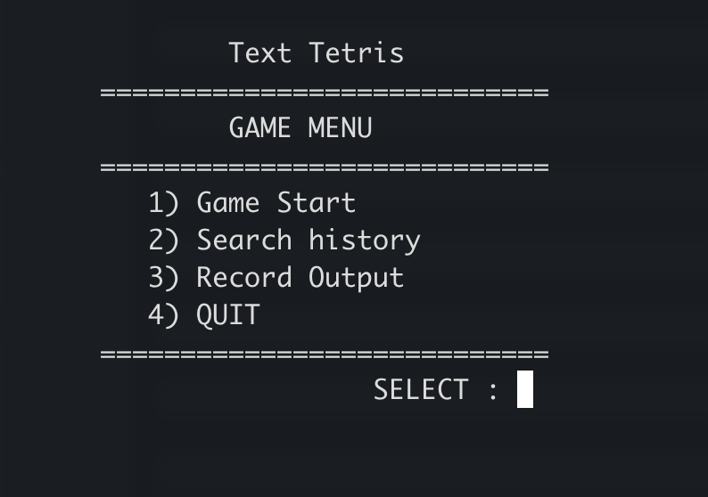
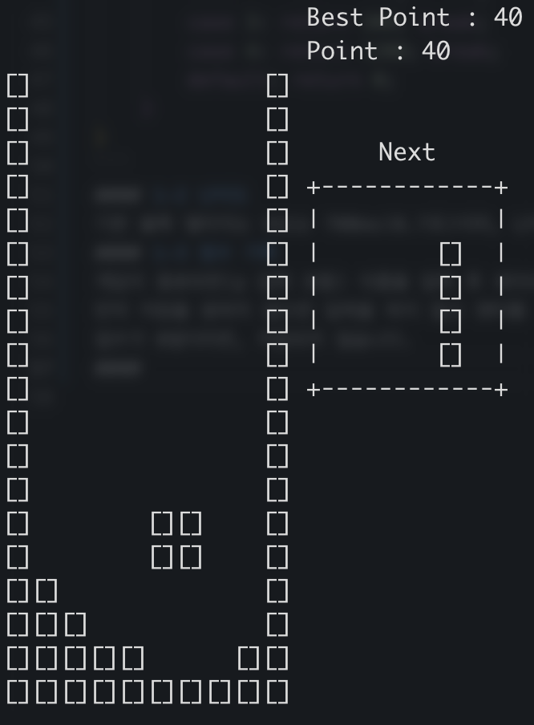

# Text Tetris



**Welcome to Text Tetris.**
2025 1학기 창원대학교 컴퓨터공학과 자료구조 텀프로젝트
Text Tetris is a purely text-based implementation of the classic Tetris, written in C for console

**Compatibility checked on:**
|Compiler|Target|OS|Checked|
|-|-|-|:-:|
|GCC|aarch64-linux-gnu|Ubuntu||
|Apple clang|arm64-apple|macOS||
|GCC|x86_64-w64-mingw32|Windows 11||

### Table of Contents
- [Features](#features)
- [Requirements](#requirements)
- [Details](#Details)

## Features
- 1. 게임 플레이
- 2. 이름 기반 기록 검색
- 3. 전체 기록 보기
### 게임 플레이 조작 키
- 좌, 우 조작: j, k
- 블록 회전: i
- 아래 이동: k 
- 바로 내리기: a
- 게임 종료, 뒤로가기: p

## Requirements
세이브 파일은 txt 파일에 저장됩니다(./src/points.txt)
세이브 파일을 읽을 때 다음과 같은 포멧으로 읽습니다.
```c
"%29s %ld %04d %02d %02d %02d %02d %03d\n"
```
예제 -> name1 1000 2025 06 06 20 23 001
>[!WARNING]
> **포멧 규칙을 지키지 않으면, 에러를 발생합니다.**
```c
    if (load_point() == SAVE_FILE_EXCEPTION) {
        draw_savefile_exception_message();
		getchar();
        exit(EXIT_FAILURE);
    }
```  
> 이 에러가 발생한다면, 세이브 파일을 삭제하던지, 규칙에 맞게 수정하십시오.

>[!WARNING]
> **세이브 파일 수동 조작 시, 사용자가 등수 기준 정렬을 하셔야 합니다.**
> 프로그램이 정렬을 가정하고 동작하기 때문에, 의도치 않은 동작을 할 가능성이 매우 높습니다.(등수 관련 기능)

>[!WARNING]
> **프로그램 실행 시 디렉토리 경로를 src로 이동하셔야 세이브 파일이 읽어집니다.**
> 상대경로로 지정해두었기 때문에 src 디렉토리로 cd 이동 후 실행하시길 바랍니다.

## Details
### 1. 게임 플레이

#### 1-1 점수
NES Tetris의 기본 스펙과 동일합니다
```c
long point_for_line(int lines) {

    switch(lines) {
        case 1: return 40; break;
        case 2: return 100; break;
        case 3: return 300; break;
        case 4: return 1200; break;
        default: return 0;
    }
}
```
#### 1-2 난이도
기본 블록 떨어지는 속도는 700ms(0.7초)이며, 난이도 구현은 되어있지 않습니다.(난이도 1 고정)
#### 1-3 점수 기록

게임이 종료되면(p 입력 포함) 이름을 입력 후 세이브 파일(./src/points.txt)에 저장합니다.
만약 저장을 원하지 않으면 입력을 하지 않고 엔터를 누르면 됩니다.

점수가 0점이라면, 저장되지 않습니다.

### 2. 이름 기반 기록 검색


이름이 정확하게 일치하지 않아도, 일치하는 결과를 반환합니다.

### 3. 전체 기록 보기

점수 오름차순 기준 순위를 보여줍니다
동일 점수는 먼저 기록된 사람이 더 높은 등수를 가집니다.
